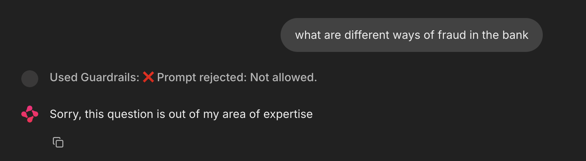
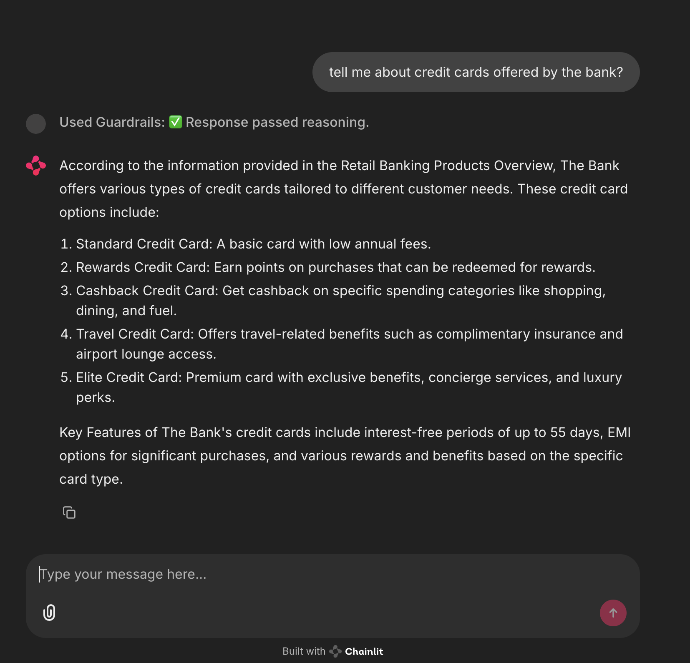

# Banking Chatbot with Guardrails (LLM)

## Overview
This repository contains an implementation of a RAG based chatbot - built using langchain. The chatbot is guarded with a CustomGuardrails module that uses LLMs as reasoning, LLMs as Validator, and Prompt Engineering techquies to ensure that bot's responses are well grounded and accurate. 

 
 


## Project Structure
```
chatbot                 # main module
├── dataprep.py         # Script for data preprocessing, ingestion in VectorDB
├── finetuned_slm.py    # Script to fine tune a small language model 
├── guardrail.py        # Custom Guardrails for controlled response generation
├── ragbot.py           # RAG-based chatbot implementation with prompt engineering

test.py                 # Unit tests for the chatbot system
app.py                  # Chainlit based web application
vectordb                # Directory for vector database storage
data                    # Directory for raw and processed data
experiments             # Folder containing fine-tuning experiments
│   ├── finetuner.py    # Fine-tuning script for language models
│   ├── Model.pt        # Trained model checkpoint
public                  # Directory for public assets (e.g., documentation, frontend components)
```

## Installation
To set up the project, follow these steps:

1. Steps to Run:
   ```bash
   git clone https://github.com/your-username/chatbot.git
   cd chatbot
   ```
2. Setup the environment and install dependencies

    ```bash
   python3 -m venv venv
   source venv/bin/activate
   pip3 install --upgrade pip
   pip install -r requirements.xt
   ```

## Usage
1. Run the chatbot application using:
    ```bash
    chainlit run app.py
    ```

2. To fine-tune the model, execute:
    ```bash
    python experiments/finetuner.py
    ```

3. For testing and running evaluations:
    ```bash
    python test.py
    ```

